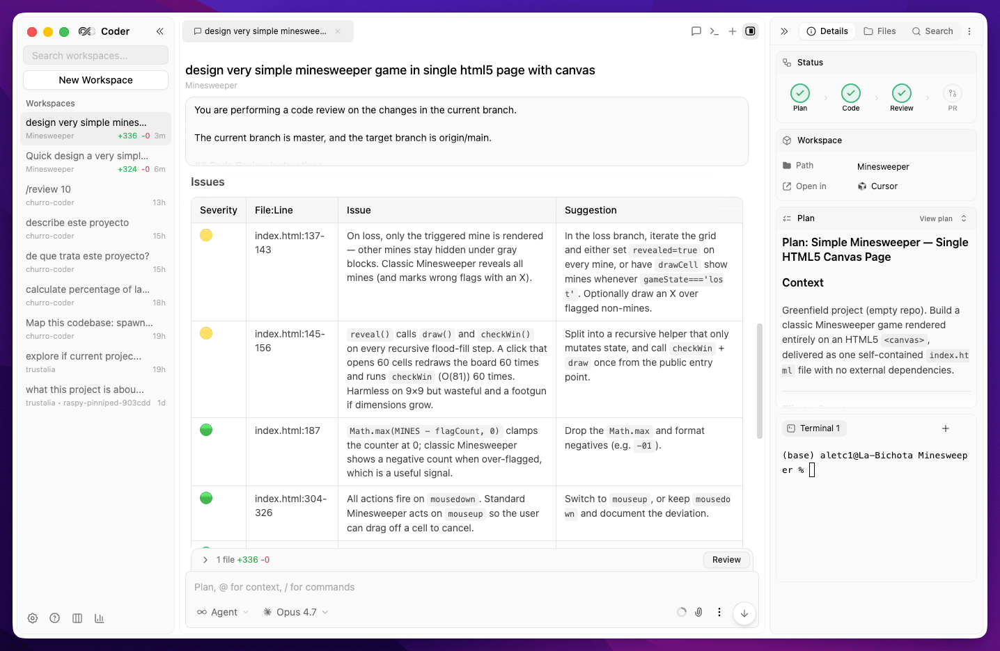

# Churro Coder

> Open-source, fully offline coding agent client. Run Claude Code, Codex, and more — locally, no cloud account needed.

Churro Coder is a desktop app for working with AI coding agents (Claude Code, Codex, …) on your own machine. Sub-chats, terminals, file viewers, plans, and diffs are first-class dock panels you can split and rearrange; each chat runs in its own git worktree so the agent can't trample your main branch; everything stays on-device — no login, no cloud sync, no analytics.



## Highlights

- **Plan → Code → Review → PR workflow.** A first-class stepper for the way most engineers actually ship: the agent drafts a plan, you approve, it codes in an isolated worktree, runs an AI review on the diff, and opens the PR — each phase has its own panel and one-click actions.
- **Mix Claude and Codex in a single chat.** Route each phase to the model that's best at it — e.g. Claude Opus as architect to design the plan, Codex/GPT to implement it, Claude Opus again to review the outcome. No copy-pasting between tools; one chat orchestrates them and you get the best of every provider.
- **Sandboxed execution.** Agent file access is locked to the chat's worktree, your config dirs (`~/.claude`, `~/.codex`, `~/.churrostack`), standard scratch space, and optionally toolchain caches — nothing else. On macOS and Linux the sandbox is enforced at the OS level (Seatbelt / bubblewrap); on other platforms the SDK-level path enforcement blocks reads and writes outside the allowed roots. Configurable per-project, per-chat, or globally from Settings → Sandbox.
- **Spend tracking built in.** See total usage and per-chat cost broken down by provider and model (`usage.png`), so the multi-model workflow above doesn't turn into a billing surprise.

## Repository layout

This is an [Nx](https://nx.dev) monorepo with three apps that share a single product surface but speak different stacks on purpose:

| App | Stack | What it does |
|-----|-------|--------------|
| [`apps/desktop`](apps/desktop/) | Electron + Vite + React + TypeScript + Tailwind, **bun-managed** | The local UI on macOS / Windows / Linux. Hosts the agents, the dockview workspace, the SQLite store, and bundled CLI binaries. |
| [`apps/gateway`](apps/gateway/) | ASP.NET Core (.NET 10) | Cloud-side NAT gateway between a daemon and clients (used for remote / browser access). |
| [`apps/daemon`](apps/daemon/) | Go (cross-platform CLI) | Installable daemon that the gateway talks to on behalf of remote clients. |

The desktop app is the primary surface; the gateway + daemon are how Churro Coder reaches a machine you're not sitting in front of.

For app-level architecture, build pipelines, schema, and gotchas, read each app's `AGENTS.md`:
- [`apps/desktop/AGENTS.md`](apps/desktop/AGENTS.md) — windowing, tRPC routers, Drizzle schema, release pipeline
- [`AGENTS.md`](AGENTS.md) — repo-level conventions for AI coding agents working in the workspace (`CLAUDE.md` is a symlink to it)

## Quick start

### Prerequisites

- **Node.js** ≥ 20
- **pnpm** (the version pinned in `package.json#packageManager` — install via `corepack enable`)
- **Bun** ([install](https://bun.sh)) — `apps/desktop` is bun-managed
- **.NET 10 SDK** (only if you'll run `gateway`)
- **Go ≥ 1.26** (only if you'll run `daemon`)
- **Xcode Command Line Tools** on macOS, build-essential on Linux — needed to compile native node modules (`better-sqlite3`, `node-pty`)

### Install + run

```bash
# Root: pnpm drives Nx + plugins
pnpm install

# apps/desktop is intentionally outside the pnpm workspace and uses bun
cd apps/desktop && bun install && cd -

# See every Nx project + the targets each one exposes
pnpm exec nx show projects        # → ["desktop","gateway","daemon"]
pnpm exec nx graph                # interactive dependency graph

# Run any single app
pnpm exec nx run desktop:dev      # Electron app with HMR
pnpm exec nx run gateway:run      # .NET API on http://localhost:5111
pnpm exec nx run daemon:serve     # Go daemon

# Or build everything (Nx caches; second run is instant)
pnpm exec nx run-many -t build
```

For platform installers (DMG / NSIS / AppImage / DEB) and the full release pipeline, see [`apps/desktop/README.md`](apps/desktop/README.md) and [`apps/desktop/AGENTS.md`](apps/desktop/AGENTS.md).

### A note on the two package managers

`pnpm` lives at the repo root and drives Nx + plugins. **Bun manages `apps/desktop` exclusively** — `pnpm-workspace.yaml` deliberately excludes that path. Don't run `pnpm install` inside `apps/desktop`; the two package managers will fight over the lockfile. This split is intentional, not a migration in progress.

## Testing

```bash
# Run all test suites (Vitest + xUnit + go test), Nx-cached
pnpm exec nx run-many -t test

# Run only tests affected by your local changes
pnpm exec nx affected -t test
```

| App | Runner | How to run directly |
|-----|--------|---------------------|
| `apps/desktop` | Vitest | `cd apps/desktop && bun run test` |
| `apps/gateway` | xUnit (`WebApplicationFactory`) | `dotnet test apps/gateway/Gateway.Tests/Gateway.Tests.csproj` |
| `apps/daemon` | `go test` | `cd apps/daemon && go test ./...` |

Desktop tests run in Node.js (no Electron). Tests that need a DOM add `// @vitest-environment jsdom` at the top of the file. See [`AGENTS.md#running-tests`](AGENTS.md#running-tests) for more details.

To generate an HTML coverage report for the desktop suite:

```bash
cd apps/desktop && bun run test --coverage && open coverage/index.html
```

## CI

GitHub Actions runs `nx run-many -t build lint test` on every PR to `main` (see [`.github/workflows/ci.yml`](.github/workflows/ci.yml)). Wire the **`CI / Build & check`** check into a branch protection rule / ruleset to gate merges.

## Contributing

Issues and PRs welcome. The repo is set up for AI coding agents too — `AGENTS.md` (and the symlinked `CLAUDE.md`) is the single source of truth for any tool working in this codebase. If you're adding a new app, follow the patterns in `AGENTS.md#adding-a-new-project`.

## License

[GNU Affero General Public License v3.0](LICENSE) — see `LICENSE` for the full text.

---

*Originally based on [21st-dev/1code](https://github.com/21st-dev/1code).*
